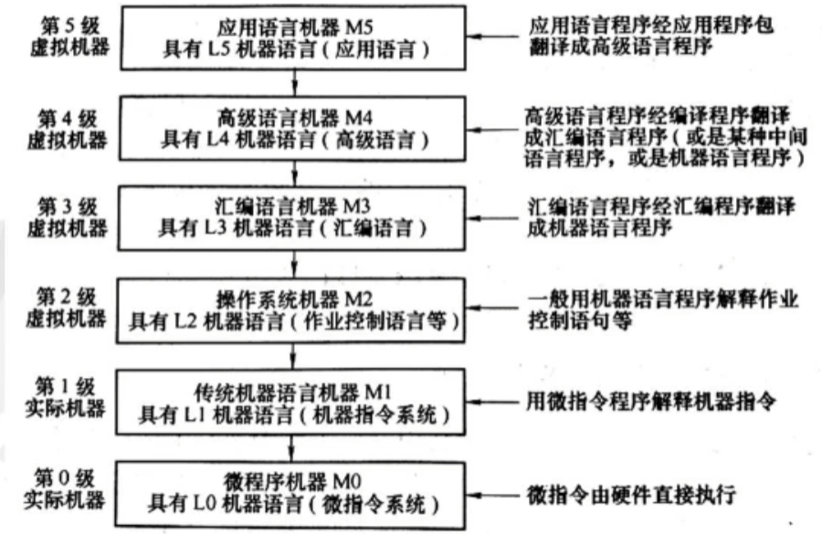
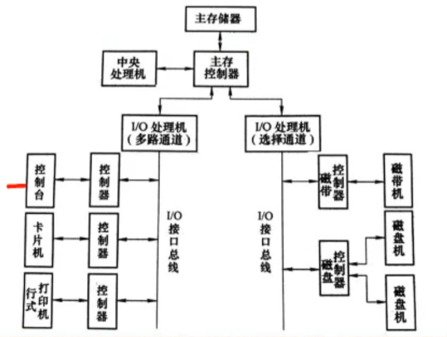
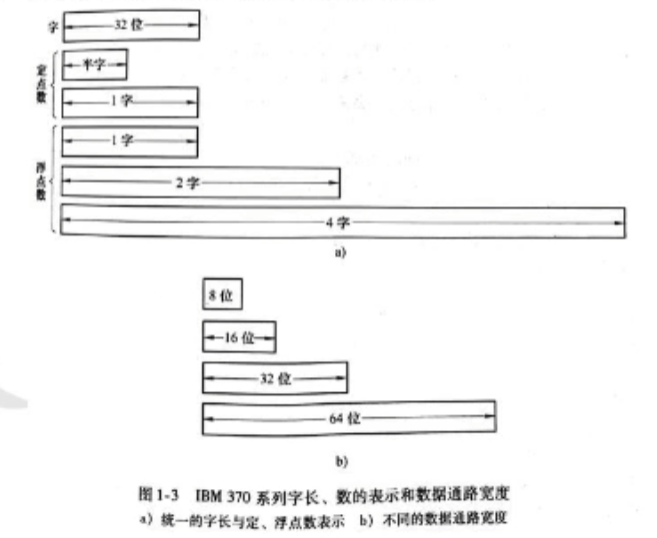
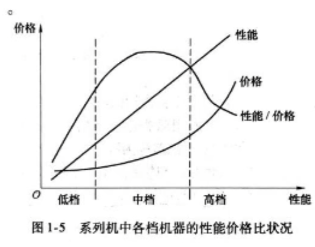
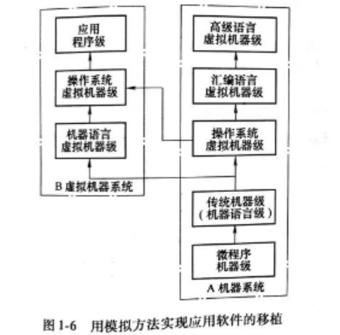
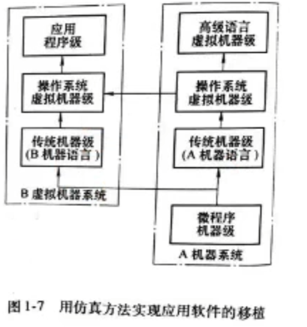
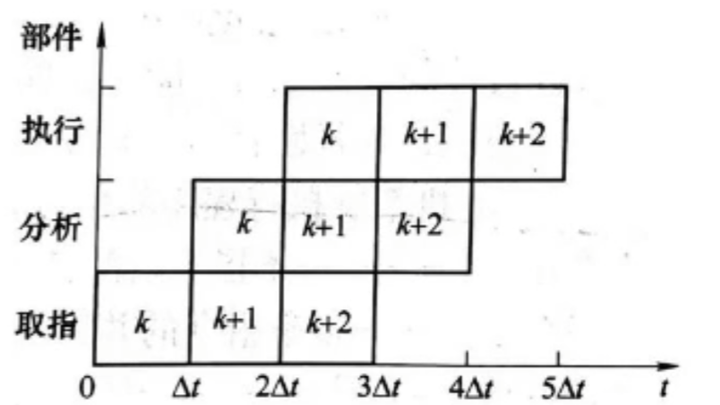
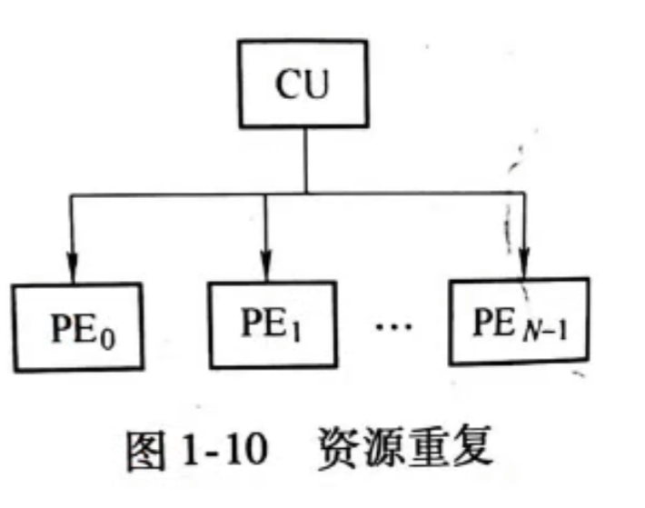
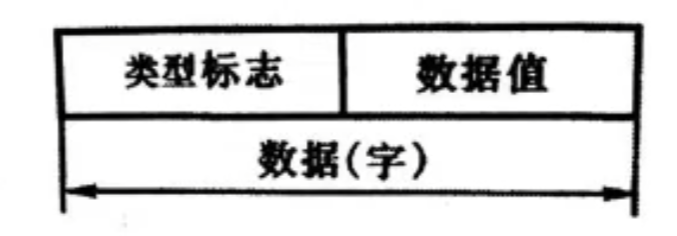
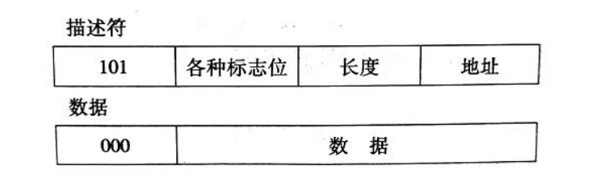

## 第一章 计算机系统的组成

### 序

计算机系统 = 硬件 + 软件

硬件(5) : 

1. 运算器
2. 控制器
3. 存储器
4. 输入设备
5. 输出设备

软件(2): 

   1. 系统软件
   2. 应用软件

### 1.1计算机系统的层次结构

#### 1.1.1 计算机系统的多层级结构

机器语言 -> 汇编语言 -> 高级语言

计算机系统的多级层次结构

**机器**被定义为能**存储**和**执行**相应语言程序的**算法**和**数据结构**的集合体

实际上，只有**二进制机器指令**，即传统所讲的机器语言与机器硬件直接对应，方可直接被硬件识别和执行。

### 1.2 计算机系统结构,计算机组成和计算机实现

> 组成,实现和定义以及研究方面
>
> 三者之间的关系和影响
>
> **透明性概念**:看不见,但自在工作

#### 1.2.1	 计算机系统结构的定义和内涵

定义:

​	从计算机的层次结构角度来看，系统结构（System Architecture）是对计算机系统中各级界面的定义及其上下级的**功能**分配。每级都有其自己的系统结构。

内涵:

​	就目前的通用机来说,计算机系统结构的属性包括:

 1. 硬件能**直接**识别和处理的数据类型以及格式等的数据表示

 2.  **最小**可寻址单位,寻址种类,地址计算等的寻址方式.

 3.  通用/专用寄存器的设置,数量,字长,使用约定等的寄存器组织

 4.  二进制或汇编指令的操作类型,格式,排序方式,控制机构等的**指令内容**

 5. 主存的**最小**编址单位,编址方式,容量,最大可编址空间等存储系统组织

 6. **中断**的分类与分级,中断处理程序功能以及入口地址等的中断机构

 7. 系统机器级的**管态**和**用户态**的定义和切换

 8. **输入/输出设备**的链接,使用方式,流量,操作结束,出错指示等的机器级I/O结构

 9. 系统各部分的**信息保护**方式和保护机构等属性

    

##### 计算机组成的定义:(逻辑上研究计算机的设计)

计算机组成（*Computer Organization*）指的是计算机系统结构的**逻辑实现**，包括机器级内部的**数据流和控制流**的组成以及逻辑设计等。

计算机组成着眼于机器级内部各事件的**排序方式**与**控制机构**,各部件的功能及各部件间的联系。

#### 1.2.2	计算机组成与计算机实现的定义和内涵

#### 计算机组成设计

**计算机组成设计**要确定的方面一般包括:

1. 数据通路的宽度(总线的一次并行传输数据的大小,**以位为单位**)

   > 总线: 计算机的运算器和存储器进行数据交互的数据通路

2. 专用部件的设置(字符处理部件,浮点数运算部件等等的部件的大小)

3. 各种操作对部件的**共享程度(**分时共享,各个部件不同时间调用CPU)

4. **功能**部件的**并行度**

   > 并行:不同程序,组件同时使用一个CPU的效率
   >
   > 并发:同时使用所有设备

5. **控制机构的组成**方式

6. **缓冲和排队**技术

7. **预估,预判**技术

8. **可靠性**技术

#### 计算机实现

  计算机实现（Computer Implementation）指的是计算机组成的**物理实现**，包括**处理机**、**主存**等部件的物理结构，器件的集成度和速度，器件、模块、插件、底板的划分与连接，专用**器件的设计**，**微组装技术**，信号传输，电源、冷却及整机装配技术等。

>  计算机实现着眼于 **器件技术** 和**微组装技术**
>
> 其中,**器件技术**起着**主导作用**
>
> 确定指令系统中是否要设置乘法指令属于计算机系统结构
>
> 主存容量与编制方式(按位,按字节,还是按字访问等)的确定属于计算机系统结构.
>
>
>
> 计算机实现的实例:
>
> 
>
> 
>
>
>
> 

### 1.3 计算机系统的软硬件取舍及定量设计原理

#### 本节主要内容

> 软、硬件实现的优缺点
>
> 软硬件取舍的基本原则
>
> 计算机系统的定量设计
>
> 3种设计思路和存在的问题
>
> "**由中间开始**"的设计方法

#### 1.3.1 软硬件取舍的基本原则

##### 软件的功能实现

软件的功能可以用**硬件**或**固件**完成,硬件的功能也可以用**软件模拟**完成,只是他们在性能,价格,实现的难易程度上是不同的.

> 固件: 显卡驱动之类的固定软件

##### 硬件取舍的优缺点

优点:

- 提高硬件功能比例可**提高解题速度**，**减少**程序所需的**存储空间**

缺点:

-  *增加硬件成本,降低硬件利用率和计算机系统的灵活性及适应性；*

##### 软件功能的优缺点

优点:

* 提高软件功能的比例可以降低硬件成本
* 提高了系统的灵活性、适应性

缺点

* *但解题速度会降低*
* *软件设计费用和所需的存储器用量增加*

##### 取舍软硬件的基本原则

1. 应考虑在现有硬、器件（主要是逻辑器件和存储器件）条件下，系统要有高的**性能价格比**，主要从实现费用、速度和其他性能要求来综合考虑。
2. 要考虑到准备采用和可能采用的**组成技术**，使之尽可能不要过多或不合理地限制各种组成、实现技术的采用。
3. 不能仅从“硬”的角度考虑如何便于应用组成技术的成果和便于发挥器件技术的进展，还应从“软”的角度把如何为编译和操作系统的实现以及为高级语言程序的设计提供更多、更好的**硬件支持**放在首位。

> 三个方面: 硬件上, 技术上 (组装技术) , 软件上

#### 1.3.2 计算机系统的定量设计原理

1. 哈夫曼( Huffman ) 压缩原理

   尽可能加速处理高概率的事件远比加速处理低概率事件对性能的提高要显著.

2. Amdahl 定律

   **改进效果**好的高性能系统应是一个**各部分性能均能平衡**得到提高的系统,而不是其中某个功能部件性能的提高

3.  程序访问的局部性定律

   程序访问的局部性包括了**时间**上和**空间**上的两个局部性.

   > 时间:两个不同时间可能会用到同一个信息
   >
   > 空间:使用内存地址0之后,下一个信息是内存地址1

 

#### 1.3.3计算机系统设计的主要任务和方法

##### 1.计算机系统设计的主要任务（填空、选择）

- 计算机系统设计的主要任务包括**系统结构**、**组成**和**实现**的设计。

- 它涉及软硬件**功能分配**、计算机**指令系统设计**、**功能组织**、逻辑设计、集成电路设计、封装、电源、冷却等许多方面。

- 计算机系统设计首先要**根据市场和应用情况**，确定用户对计算机系统的**功能、性能和价格**的要求。
  其中，**应用软件对功能的确定起主要作用**。（需求决定一切）

###### 计算机系统设计的主要任务:

1. 要弄清楚其应用领域是**专用的**还是**通用的**
2. 要弄清软件兼容是放在**哪级层次**
3. 要弄清对**操作系统**有何种需求
4. 如何保证有高的标准化程度

###### 计算机系统的设计方法

1. "由上往下"设计,也称"自顶向下"设计
2. "由下往上"设计,也称"自底向顶"设计
3. "从中间开始"向两边设计,**这是通用机一般的设计方法**

> 中间: 虚拟机器与现实机器的中间

### 1.4 软件,应用,器件的发展对系统结构的影响

#### 1.4.1 软件发展对系统结构的影响

1. 统一高级语言

2. 采用*系列机* 

   > 例如, IBM 370 ,115 ...
   >
   > 苹果手机... 
   >
   > 
   >
   > 系列机软件让现在编制的程序以后都能用，这是系列机软件兼容的最基本要求和特征，即系列机软件**必须保证向后兼容**，力争向前兼容。向上同向前。

3. 模拟和仿真

   > 仿真和模拟的主要区别:
   >
   > 模拟是使用**机器语言程序**解释,其解释程序存放于主存之中;
   >
   > 仿真是使用**微机器语言**解释,其解释程序储存于**控制存储器**之中	

   1. 模拟

      > 

   2. 仿真

      > 

   3. 模拟和仿真的选择---------------**需求决定**

#### 1.4.2 应用的发展对系统结构的影响

计算机应用可归纳为向上升级的4类，它们是**数据处理**（DataProcessing）、**信息处理**(Information Processing ）、**知识处理**( Knowledge Processing )和**智能处理**(IntelligencePro-cessing）。

> 数据处理: DB
>
> 信息处理: 简单的信息
>
> 知识处理: 解决问题的方法的储备
>
> 智能处理: 根据问题提取信息和知识来处理问题

#### 1.4.3 器件发展对系统结构的影响

1. 器件**集成度的提高**,使器件的速度迅速提高,机器主频和速度也有数量级的提高

2. 器件**可靠性**有数量级的提高，保证流水技术的实现；

3. **高速、廉价的半导体存储器**的出现，使解题速度得以迅速提高的高速缓冲存储器和虚拟存储器的概念真正实现；（价格降低）

4. 现场型**PROM器件**，使微程序技术得以实现；（新材料）

      > PROM: A **programmable read-only memory** (**PROM**) is a form of digital memory where the contents can be changed once after manufacture of the device. 

5. **高速相联存储器**的实现，促进相联处理机这种结构的发展，推动向量机、数组机、数据库机的发展。（新技术）

    > 两个功能方向
    >
    > 两个材料方面
    >
    > 一个技术方面

**结论**：软件、应用、器件对计算机系统结构的发展有着很大的影响，反过来，计算机系统结构的发展又会对软件、应用、器件提出新的发展要求。

结构设计不仅要了解结构、组成、实现，还要充分了解软件、应用、器件的发展，这样才能对计算机系统结构进行有效的设计、研究和探索。

### 1.5  系统结构的并行性开发以及计算机系统的分类

#### 1.5.1 并行性的概念与开发

##### 1.并行性的含义与级别

并行性包含**同时性**与**并发性**二重含义

1. 从计算机系统执行程序的角度来看,并行性等级由低到高可分为四级:

   |                |                                      |
   | -------------- | :----------------------------------: |
   | 指令内部       | 一条指令内部各个微操作之间的并行执行 |
   | 指令之间       |          多条指令的并行执行          |
   | 任务或进程之间 |      多个任务或程序段的并行执行      |
   | 作业或程序之间 |     多个作业或多道程序的并行执行     |

2. 从计算机系统中**处理数据**的角度来看，并行性等级从低到高可以分为四级。

   1. **位串字串**: **同时只对一个字的一位进行处理**，串行单处理机，没有并行性。( 00**1**10100 ,11010100）
   2. **位并字串**:**同时对一个字的全部位进行处理**，这通常是指传统的并行单理机，开始出现并行性。（**00110100**，11010100）
   3. **位片串字并**:同时对许多字的同一位（称位片）进行处理，开始进入并行处理领域。（00110100，111010100）(同时处理第三位)
   4. **全并行**:同时对许多字的全部或部分位组进行处理（**00110100**，**11010100**）

3. 并行性是贯穿于计算机**信息加工**的各个步骤和阶段的，从这个角度来看，并行性等级又分为：

   1. 存储器操作并行(如:同时写硬盘)

   2. 处理器操作步骤并行(如:多个同时运算)

   3. 处理器操作并行(如:**同时运行多个操作处理器的指令**)

   4. 指令、任务、作业并行

      

##### 2.并行性开发的途径

1. 时间重叠 : 在时间上进行重叠

   > 

2. 资源重复 :  *双工系统,多个处理机*

   > **

3. 资源共享 : 

   > 分时共享CPU资源

#### 1.5.2计算机系统的分类

1966年，弗林（MichaelJFlynn）**按指令流和数据流的多倍性**把计算机系统分成:

1. 单指令流单数据流（Single Instruction Stream Single DataStream,**SISD** ) 
2. 单指令流多数据流（Single Instruction Stream Multiple DataStream,**SIMD** ) 
3. 多指令流单数据流（**MISD**）
4. 多指令流多数据流（**MIMD** )

1972年，美籍华人冯泽云（Tse-yun Feng）提出了用**数据处理的并行度来**定量地描述 各种计算机系统特性的冯氏分类法。他把计算机系统分成四类

1. 字串位串（**WSBS**）称位串处理方式。
2. 字串位并（**WSBP**）称字（字片）处理方式。
3. 字并位串（**WPBS**）称位（位片）处理方式。
4. 字并位并（**WPBP**）称全并行处理方式。

1978年，美国的库克（DavidJ.Kuck）提出用**指令流和执行流**（Execution Stream）及其多倍性来描述计算机系统总控制器的结构特点。

1. 单指令流单执行流（**SISE**）典型的单处理机系统。
2. 单指令流多执行流（**SIME**）带多操作部件的处理机。
3. 多指令流单执行流（**MISE**）带指令级多道程序的单处理机。
4. 多指令流多执行流（**MIME**）—典型的多处理机系统。

## 第二章 数据表示,寻址方式与指令系统

### 2.1数据表示

1.数据表示与数据结构

数据表示指的是能由计算机硬件**识别和引用**的**数据类型**，表现在它有对这种类型的数据进行操作的**指令和运算部件**。

早期的计算机只有定点数据表示,要想用**浮点数**就得用两个**定点数**来分别表示其**阶码**和**尾数**。

 

#### 2.1.2高级数据表示

##### 1.自定义数据表示

自定义（Self-defining）数据表示包括**标识符**数据表示和**数据描述符**两类。

> 标识符数据表示: 用于指明数据类型
>
> 

标识符数据表示的主要优点:

1. 简化了**指令系统**和**程序设计**

2. 简化了**编译程序**
3. 便于**实现一致性校验**(可以先判断是否是同一类型)
4. 能由硬件**自动变换数据类型**(改变类型标志符)
5. 支持**数据库系统**的实现与数据类型无关的要求，使程序不用修改即可处理多种不同类型的数据
6. 为软件**调试**和应用软件**开发**提供了支持。

###### 数据描述符和标志符的差别

标志符是和每个数据**相连**的,合存在一个存储单元中,描述**单个数据**的类型特征；
数据描述符则是与数据**分开存放**,用于描述所要访问的数据是**整块**的还是**单个**的，访问该数据块或数据元素所要的地址以及其他信息等。

> 差别
>
> 

##### 2.向量,数组数据表示

为向量、数组数据结构的实现和快速运算提供更好的硬件支持的方法是**增设向量、数组数据表示，组成向量机**。

##### 3.堆栈数据表示

堆栈计算机表现于（特点）：

1. 由高速寄存器组成的硬件堆栈,并附加控制电路,让它与主存中的堆栈区在逻辑上构成整体,**使堆栈的访问速度是寄存器的,容量是主存的**。(寄存器的速度更快(三缓) 主存容量比寄存器更大)
2. 有丰富的**堆栈操作指令**且功能很强,可直接对堆栈中的数据进行各种运算和处理。
3. 有力地**支持了高级语言程序的编译。**
4. 有力地**支持了子程序的嵌套和递归调用。**

 

#### 2.1.3 引入数据表示的原则

##### 原则1

看**系统的效率是否有显著提高**，包括**实现时间和存储空间**是否有**显著减少**。实现时间是否减少又主要看在主存和处理机之间传送的信息量是否减少。传送的信息量越少，实现时间就越少。

##### 原则2

看引入这种数据表示后，其**通用性**和**利用**率**是否提高**。如果只对某种数据结构的实现效率很高，而对其他数据结构的实现效率很低，或者引入这种数据表示在应用中很少用到,那么为此所耗费的硬件过多却并未在性能上得到好处，必然导致性能价格比的下降，特别是一些复杂的数据表示。

# 精讲P3 时间56:16