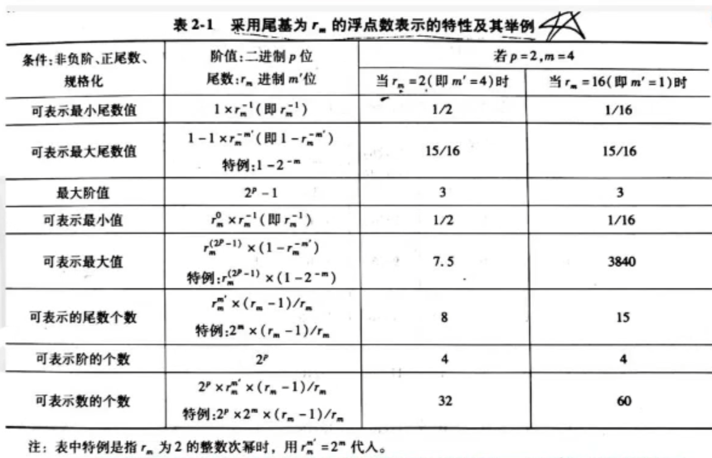

## 第二章 数据表示,寻址方式与指令系统

### 2.1数据表示

1.数据表示与数据结构

数据表示指的是能由计算机硬件**识别和引用**的**数据类型**，表现在它有对这种类型的数据进行操作的**指令和运算部件**。

早期的计算机只有定点数据表示,要想用**浮点数**就得用两个**定点数**来分别表示其**阶码**和**尾数**。

 

#### 2.1.2高级数据表示

##### 1.自定义数据表示

自定义（Self-defining）数据表示包括**标识符**数据表示和**数据描述符**两类。

> 标识符数据表示: 用于指明数据类型
>
> 

标识符数据表示的主要优点:

1. 简化了**指令系统**和**程序设计**

2. 简化了**编译程序**
3. 便于**实现一致性校验**(可以先判断是否是同一类型)
4. 能由硬件**自动变换数据类型**(改变类型标志符)
5. 支持**数据库系统**的实现与数据类型无关的要求，使程序不用修改即可处理多种不同类型的数据
6. 为软件**调试**和应用软件**开发**提供了支持。

###### 数据描述符和标志符的差别

标志符是和每个数据**相连**的,合存在一个存储单元中,描述**单个数据**的类型特征；
数据描述符则是与数据**分开存放**,用于描述所要访问的数据是**整块**的还是**单个**的，访问该数据块或数据元素所要的地址以及其他信息等。

> 差别
>
> 

##### 2.向量,数组数据表示

为向量、数组数据结构的实现和快速运算提供更好的硬件支持的方法是**增设向量、数组数据表示，组成向量机**。

##### 3.堆栈数据表示

堆栈计算机表现于（特点）：

1. 由高速寄存器组成的硬件堆栈,并附加控制电路,让它与主存中的堆栈区在逻辑上构成整体,**使堆栈的访问速度是寄存器的,容量是主存的**。(寄存器的速度更快(三缓) 主存容量比寄存器更大)
2. 有丰富的**堆栈操作指令**且功能很强,可直接对堆栈中的数据进行各种运算和处理。
3. 有力地**支持了高级语言程序的编译。**
4. 有力地**支持了子程序的嵌套和递归调用。**

 

#### 2.1.3 引入数据表示的原则

##### 原则1

看**系统的效率是否有显著提高**，包括**实现时间和存储空间**是否有**显著减少**。实现时间是否减少又主要看在主存和处理机之间传送的信息量是否减少。传送的信息量越少，实现时间就越少。

##### 原则2

看引入这种数据表示后，其**通用性**和**利用**率**是否提高**。如果只对某种数据结构的实现效率很高，而对其他数据结构的实现效率很低，或者引入这种数据表示在应用中很少用到,那么为此所耗费的硬件过多却并未在性能上得到好处，必然导致性能价格比的下降，特别是一些复杂的数据表示。

#### 2.1.4 浮点数尾数基值大小和下溢处理方法的选择

##### 1.浮点数尾数基值的选择（计算）

阶码部分包含了**阶符**和**阶值**两部分。阶码部分可用原码、补码或增码（也称移码）表示。不管怎么表示p + 1位阶码部分中影响阶值大小的实际只有p位。

数学中实数在数轴上是连续分布的。但由于计算机字长有限,浮点数只能表示出数轴上分散于正、负两个区间上的部分离散值，如下图所示。

浮点数**阶值的位数p**主要影响两个可表示区的大小，即可表示数的范围大小，而**尾数的位数m**主要影响在可表示区中能表示值的精度。由于计算机中尾数位数限制，实数难以精确表示，因此，不得不用较接近可表示数来近似表示,产生的误差大小就是数的表示精度。

> 8位计算机无法表示10位的浮点数,更大的计算机以此类推

##### 2.浮点数尾数的下溢处理方法

1. 截断法
   截法是将尾数超出计算机字长的部分截去，这种方法的好处是实现最简单

2. 舍入法
   舍入法是在计算机运算的规定字长之外增设一位**附加位**，**存放溢出部分的最高位**，每当进行尾数下溢处理时，将附加位加1（二进制整数相当于加0.5,二进制小数相当于加） 这种方法的好处是实现简单
3. 恒置“1”法
   恒置“1”法是将计算机运算的规定字长的最低位恒置为 "1"
   这种方法的好处是实现最简单，不需要增加硬件和处理时间，**平均误差趋于0**。
   主要缺点是最大**误差最大**，比截断法的还要大。 

4. 查表舍入法
   查表舍入法是用ROM或PLA存放下溢处理表

> 查表舍入法（文字题）
> 	ROM表共需2^k个单元,地址用k位二进制码表示,每个存储单元字长k-1位。
> 	当存储器k位地址码之高k-1位为全"1”时,对应单元内容填k-1位全"1"
> 	其余情况按k位二进制地址码最低位为 "0" 舍弃,为“1"进1来填k-1位内容。

### 2.2 寻址方式

#### 2.2.1 寻址方式的三种面向

寻址方式指的是指令按什么方式寻找（或访问）到所需的**操作数或信息**的。
寻址方式在多样性、灵活性、寻址范围、地址映像算法和地址变换速度等方面都有了很大的进展。

寻址方式的3种面向:

多数计算机都将**主存、寄存器、堆栈**分类编址，分别有**面向主存**、**面向寄存器** 和**面向堆栈** 的寻址方式。

面向主存的寻址主要访问主存，少量访问寄存器。
面向寄存器的寻址主要访问寄存器，少量访问主存和堆栈。
面向堆找的寻址主要访问堆栈，少量访问主存或寄存器。

#### 2.2.2寻址方式在指令中的两种指明方式

寻址方式在指令中一般有两种不5同的指明方式，（填空）

1. 占用**操作码**中的某些位来指明。
2. 不占用操作码，而是在**地址码**部分专门设置寻址方式位字段指明。

#### 2.2.3 程序在主存中的定位技术

**逻辑地址**是程序员编程用的地址.(逻辑连续)

主存**物理地址**是程序在主存中的实际地址.

1. 静态再定位

   	在目的**程序装入主存**时，由装入程序用软件方法把目的程序的**逻辑地址变换成**
   **物理地址.**
   程序执行时，**物理地址不再改变**，称这种定位技术为静态再定位。

2. 动态再定位: 在执行每条指令时才形成访存物理地址的方法(同时支持基址和变址)

   在程序不做变换直接装入主存的同时，将装入主存的起始地址a存入对应该道程序使用的基址寄存器中。
   程序执行时，只要通过地址加法器将逻辑地址加上基址寄存器的程序基址形成物理(有效)地址后去访问即可.

   

> 基址寻址 :逻辑地址空间到物理地址空间变换的支持,利于程序的动态在定位
>
> 变址寻址 :数据块运算的支持(数据块如:向量,数组)
>
> 虚实地址映像表
> 地址加界法要求程序员所用编址空间不能超出实际主存的容量。20世纪70年代，采用虚拟存储器增加了映
> 像表硬件后，使程序空间可以超过实际主存空间。（详情第四章）(允许小溢出)

### 2.3 指令系统的设计和优化

